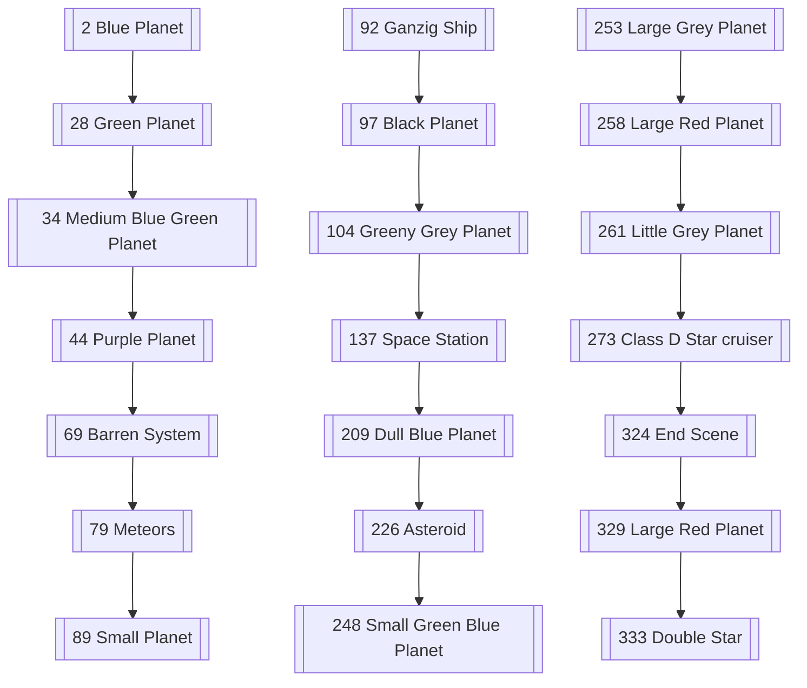
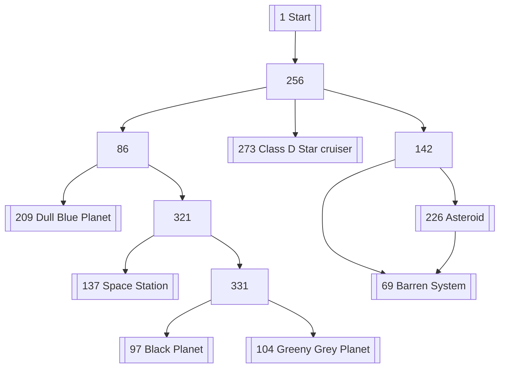

```mermaid
	graph
		2[[2 Blue Planet]] -->
		28[[28 Green Planet]] -->
		34[[34 Medium Blue Green Planet]] -->
		44[[44 Purple Planet]] -->
		69[[69 Barren System]] -->
		79[[79 Meteors]] -->
		89[[89 Small Planet]]

		92[[92 Ganzig Ship]] -->
		97[[97 Black Planet]] -->
		104[[104 Greeny Grey Planet]] -->
		137[[137 Space Station]] -->
		209[[209 Dull Blue Planet]] -->
		226[[226 Asteroid]] -->
		248[[248 Small Green Blue Planet]]

		253[[253 Large Grey Planet]] -->
		258[[258 Large Red Planet]] -->
		261[[261 Little Grey Planet]] -->
		273[[273 Class D Star cruiser]] -->
		324[[324 End Scene]] -->
		329[[329 Large Red Planet]] -->
		333[[333 Double Star]]

		click 2 href "2.html"
		click 28 href "28.html"
		click 34 href "34.html"
		click 44 href "44.html"
		click 69 href "69.html"
		click 79 href "79.html"
		click 92 href "92.html"
		click 97 href "97.html"
		click 104 href "104.html"
		click 137 href "137.html"
		click 209 href "209.html"
		click 226 href "226.html"
		click 248 href "248.html"
		click 253 href "253.html"
		click 258 href "258.html"
		click 261 href "261.html"
		click 273 href "273.html"
		click 324 href "324.html"
		click 329 href "329.html"
		click 333 href "333.html"
```

```mermaid
    graph TD
        1[[1 Start]]
        69[[69 Barren System]]
        97[[97 Black Planet]]
        104[[104 Greeny Grey Planet]]
        137[[137 Space Station]]
        209[[209 Dull Blue Planet]]
        226[[226 Asteroid]]
        273[[273 Class D Star cruiser]]

        1 --> 256
        256 --> 86 & 273 & 142

        86 --> 209 & 321
        321 --> 137 & 331
        331 --> 97 & 104

        142 --> 69 & 226

        226 --> 69

        1:::startPoint
        69:::startPoint
        97:::startPoint
        104:::startPoint
        137:::startPoint
        209:::startPoint
        226:::startPoint
        273:::startPoint

        click 1 href "#1" "1 Start"
        click 69 href "69.html" "69 Barren System"
        click 97 href "97.html" "97 Black Planet"
        click 104 href "104.html" "104 Greeny Grey Planet"
        click 137 href "137.html" "137 Space Station"
        click 209 href "209.html" "209 Dull Blue Planet"
        click 226 href "226.html" "226 Asteroid"
        click 273 href "273.html" "273 Class D Star cruiser"
```
